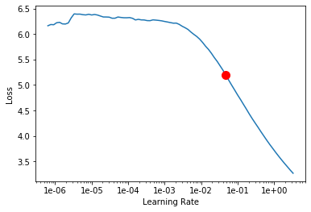
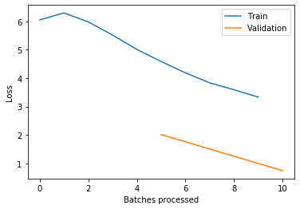

# ULMFiT_Sentiment_Analysis

**Introduction**
ULMFiT(Universal Language Model Fine-tuning for Text Classification) is a transfer learning technique that involves creating a Language Model that is capable of predicting the next word in a sentence, based on unsupervised learning of the WikiText 103 corpus. The ULMFiT has multiple LSTM layers, with dropout applied to every layer.
The fast.ai wrapper wraps around ULMFiT and makes the text classification task easier but under the hood the concepts are quite complex. 

**Objective**
The objective of the project is to classify the sentiment expressed in the tweets. 

**Data-set**
https://www.kaggle.com/crowdflower/twitter-airline-sentiment

**Results**
The classifier built could classify with a decent accuracy of `0.82`. The optimal learning rate was found using LR_finder. The behaviour of the LR_finder is shown below. 

The optimal learning rate on the training set is found and  is used in the validation/test set. 
The behaviour of the loss function during training and validation is shown below. 

